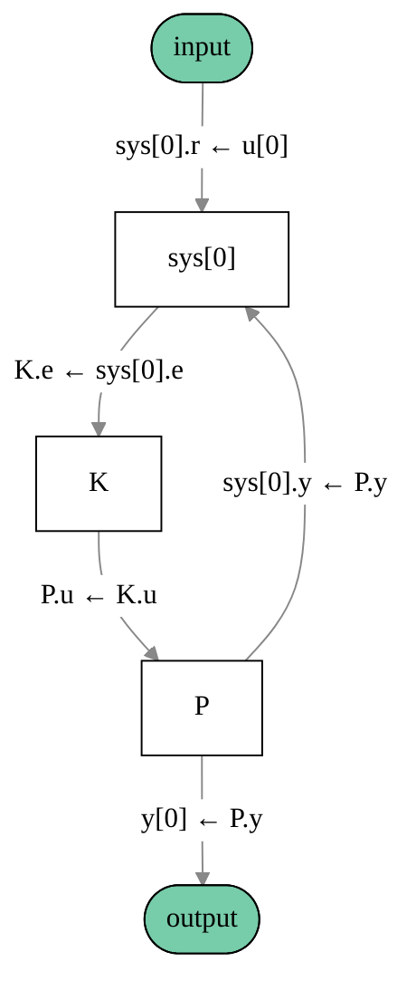

# pyctrl-block-diagram

Test development of a Python package for creating block diagrams of `InterconnectedSystem`s using Python Control Systems Library.

-----

## Installation

```console
# conda install -c conda-forge control slycot -y
# pip uninstall pyctrl-block-diagram -y  # for reinstallation
pip install git+https://github.com/knttnk/pyctrl-block-diagram.git
```

## Usage

```python
import pyctrl_block_diagram as pbd
import control

P = control.ss(1, 2, 3, 0, name="P", inputs='u', outputs='y')
K = control.ss(0, 0, 0, -0.5, name="K", inputs='e', outputs='u')
sumblk = control.summing_junction(inputs=['r', '-y'], output='e')

T = control.interconnect([P, K, sumblk], inplist='r', outlist='y')

pbd.show_block_diagram(T)
```

The following block diagram will be displayed in your browser:



## License

`pyctrl-block-diagram` is distributed under the terms of the [MIT](https://spdx.org/licenses/MIT.html) license.
